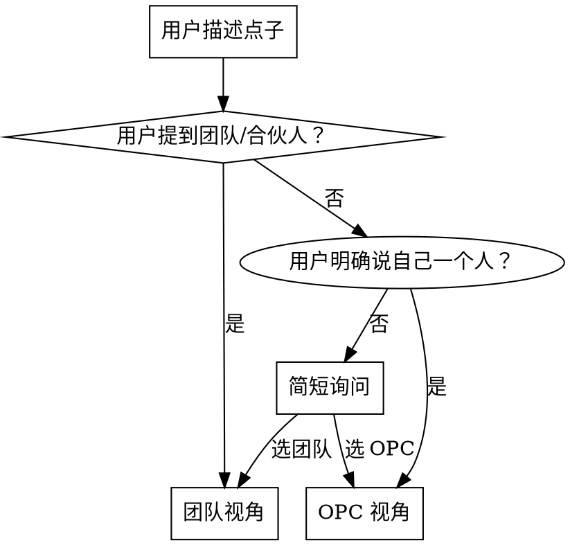
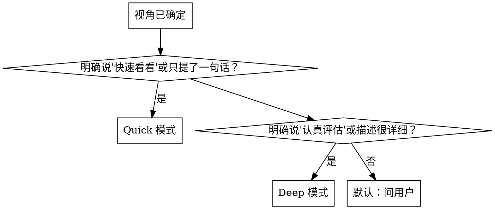

# Idea Killer — 点子杀手

帮助 OPC（一人公司）或小团队在投入时间之前，用真实数据和结构化框架快速评估和淘汰点子。

核心信念：**90%+ 的点子应该在前 5 分钟被淘汰**。杀得快比选得准更重要。

## 铁律

```
没有调研就没有发言权 — 每个结论必须有搜索到的数据支撑
杀得快比选得准更重要 — 遇到红灯就停，不要试图拯救一个坏点子
一个周末能上线吗？ — OPC 标准；团队放宽到两周
跟随用户语言 — 用户用什么语言描述点子，就用什么语言输出评估
淘汰不等于否定 — 即使建议放弃，也要肯定闪光点，提供发散思路和改进方向
```

违反这些原则就是违反点子评估的精神。如果你发现自己试图为点子找理由而不是
找问题，停下来，重新审视。

## 视角 + 模式检测

用户描述点子后，先确定视角，再判断模式。

### 第一步：确定视角



判断依据：
- **OPC**：用户说"我一个人做"、"个人项目"、独立开发者
- **团队**：用户提到"我们团队"、"合伙人"、"几个人一起"
- **不确定**：简短地问"你是 OPC（一个人做）还是有团队？"

选定视角后，后续所有模型评估使用对应的视角适配标准。

### 第二步：确定模式



判断依据：
- **Quick**：用户只说了一句话、说"帮我快速看看"、灵感闪现
- **Deep**：用户说"认真评估"、描述包含具体功能/目标用户/商业模式、表示想投入时间
- **不确定**：简短地问用户"想快速看看还是认真评估？"

## 执行流程

确定视角和模式后，读取对应的流程文件并严格遵循：

### Quick 模式
→ 读取 `modes/quick.md` 并按流程执行

### Deep 模式
→ 读取 `modes/deep.md` 并按流程执行

两种模式的流程文件会告诉你按什么顺序读取 `models/` 和 `agents/` 文件。
**不要提前读取所有文件**，按流程指引逐步加载，避免浪费 token。

**重要**：执行模型评估时，根据用户选择的视角（OPC / 团队），
使用模型文件中对应的视角适配段落进行评估。

## 评估模型索引

以下是 8 个可用的评估模型。流程文件会指定在当前模式下使用哪些模型、
按什么顺序。每个模型文件包含：核心问题、判定规则、OPC 视角适配、团队视角适配。

| 文件 | 模型 | 一句话用途 |
|------|------|-----------|
| `models/traffic-light.md` | 红黄绿灯 | 这个点子是必须做、可以做、还是别做？ |
| `models/domain-check.md` | 领域专项检查 | 这个行业有什么特有的坑和合规要求？ |
| `models/value-complexity.md` | 价值-复杂度矩阵 | 投入产出比怎么样？ |
| `models/five-forces.md` | 五力分析 | 市场竞争格局对你有利吗？ |
| `models/fatal-assumptions.md` | 致命假设 | 最核心的假设站得住脚吗？ |
| `models/lean-canvas.md` | 精益画布 | 商业模式的关键要素都想清楚了吗？ |
| `models/rice.md` | RICE 优先级 | 如果要做，该从哪里开始？ |
| `models/levels-method.md` | Levels 方法 | 一个周末能验证吗？ |

## Agent 索引

仅 Deep 模式使用。三个研究 agent 并行执行，各自搜索一个方向：

| 文件 | 方向 | 核心问题 |
|------|------|----------|
| `agents/competitor-research.md` | 竞品研究 | 这个领域已有产品是谁？ |
| `agents/case-study.md` | 案例研究 | 类似赛道有成功/失败案例吗？ |
| `agents/mvp-theory.md` | MVP 理论 | 这个领域的 MVP 最佳实践是什么？ |

## 输出模板

评估完成后，读取对应的模板文件套用输出：

| 模式 | 模板文件 |
|------|----------|
| Quick | `templates/quick-report.md` |
| Deep | `templates/deep-report.md` + `templates/mvp-doc.md` |

Deep 模式输出分两步：
1. 先在终端展示评估概要（引用 `templates/deep-report.md`）
2. 再将完整 MVP 文档保存为 MD 文件（引用 `templates/mvp-doc.md`）

## 自洽性检查

完成评估后，快速过一遍：

- [ ] 每个结论都有数据支撑（竞品、案例、市场信息），不是纯主观判断
- [ ] 如果搜索数据不完整，已在报告中标注"⚠️ 部分数据基于 AI 训练知识"
- [ ] 如果点子被建议放弃，给出了具体原因而非模糊的"市场不好"
- [ ] 如果点子被建议放弃，也包含闪光点 & 发散方向
- [ ] 如果点子被建议推进，识别了最核心的风险和假设
- [ ] 领域专项检查已执行（如果点子匹配到了某个领域）
- [ ] 输出格式符合对应模板的要求
- [ ] 评估使用了正确的视角适配（OPC / 团队）
- [ ] 输出语言与用户的输入语言一致
- [ ] Deep 模式：MVP 文档已保存到工作目录

## 红旗清单

以下想法意味着你可能偏离了 skill 的初衷：

| 想法 | 现实 |
|------|------|
| "让我多想几个优势" | 你的任务是找问题，不是找理由 |
| "这个点子也许可以..." | 也许可以 = 大概率不行，说清楚为什么不行 |
| "用户可能会需要" | "可能"不是验证，去找真实数据 |
| "我先把所有模型都过一遍" | Quick 模式就两个模型，别过度分析 |
| "让我把这个点子改一改再评估" | 评估原始点子，不要边评估边修改 |
| 用户用中文提问但我用英文回答 | 跟随用户的语言，不要自行切换 |
| "这个点子不行，下一个吧" | 淘汰点子≠否定人。指出闪光点，给出发散思路或改进方向 |
