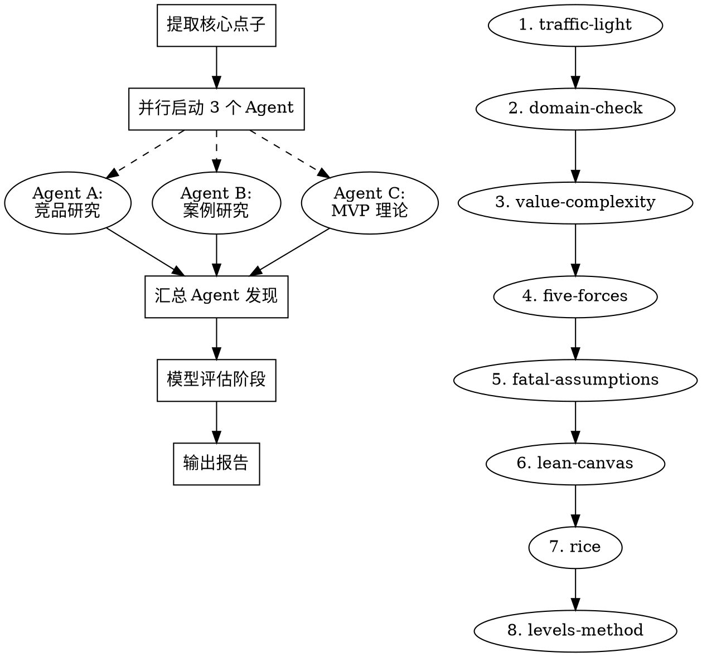

# Deep 模式流程

完整调研 + 结构化评估 + MVP 文档输出。适用于用户认真考虑投入时间的场景。
并行启动 3 个研究 agent，然后用 7 个评估模型逐个分析，最后输出完整报告。

## 流程

### Phase 1：提取核心点子 + 确认

从用户的描述中提炼出完整的信息：

> - **点子**：[一句话描述]
> - **视角**：[OPC / 团队]
> - **目标用户**：[谁]
> - **核心价值**：[解决什么问题]
> - **{OPC: 用户已有的技能/资源 / 团队: 团队配置和能力}**：[方便评估可行性]
> - **用户能投入的时间**：[周末项目 / 兼职 / 全职]

如果用户没说清楚以上信息，**先问再开始**。不要在信息不完整的情况下
启动 agent 搜索，那会浪费搜索配额。

#### 技能/资源信息引导

如果用户说不出自己有什么技能或资源，用以下问题引导：
- "你平时工作中用什么技术栈？"
- "你有没有在运营什么社区或社交媒体账号？"
- "你在这个领域有什么特别的经历或人脉？"
- "你之前做过什么产品或项目？"

这些信息直接影响 OPC 可行性的评估准确性。

### Phase 2：并行启动研究 Agent

使用 WebSearch 工具，**同时在一条消息中发起所有搜索**，并行执行三个方向：

1. 读取 `agents/competitor-research.md` → 执行竞品研究搜索
2. 读取 `agents/case-study.md` → 执行案例研究搜索
3. 读取 `agents/mvp-theory.md` → 执行 MVP 理论搜索

**搜索原则**：
- 每个方向 2-3 组搜索 query
- 搜索结果汇总后形成结构化的研究发现
- 搜索到的信息用于后续的模型评估，作为"真实数据支撑"

#### 数据可靠性检查

Agent 搜索完成后，检查数据质量：
- **搜索正常完成**：报告使用"基于实时搜索数据"，放心进入评估阶段
- **搜索部分失败**（配额耗尽/网络问题）：在后续报告中标注
  "⚠️ 部分数据基于 AI 训练知识而非实时搜索，可能存在时效性问题"
- **搜索全部失败**：告知用户数据不足的情况，建议切换到 Quick 模式
  或等搜索恢复后再做 Deep 评估。不要在没有数据支撑的情况下做 Deep 评估。

### Phase 3：模型评估（8 个模型依次执行）

基于 Phase 2 搜索到的真实数据，依次读取并执行 8 个评估模型：

| 顺序 | 模型文件 | 目的 |
|------|----------|------|
| 1 | `models/traffic-light.md` | 快速分层，如果红灯直接标记 |
| 2 | `models/domain-check.md` | 领域专项检查（合规风险 + 行业特有坑） |
| 3 | `models/value-complexity.md` | 判断投入产出比 |
| 4 | `models/five-forces.md` | 分析市场竞争环境 |
| 5 | `models/fatal-assumptions.md` | 识别并验证核心假设 |
| 6 | `models/lean-canvas.md` | 梳理商业模式要素 |
| 7 | `models/rice.md` | 如果推进，确定优先级 |
| 8 | `models/levels-method.md` | OPC 快速验证可行性 |

**关键**：每个模型的评估都应该引用 Phase 2 搜索到的具体数据。
不要脱离数据做纯主观判断。

**模型间衔接**：领域专项检查（模型 2）的发现会直接影响后续模型的评估——
如果领域检查发现高合规风险，五力分析的"供应商议价"要考虑监管机构的力量，
致命假设要包含合规相关的假设。每个模型不是孤立的，前一个模型的发现
应该影响后一个模型的判断。

**视角适配**：每个模型文件包含"OPC 视角适配"和"团队视角适配"两段内容。
根据 Phase 1 确定的视角，使用对应的适配段落进行评估。

**提前终止**：如果在模型 1-5 的评估中已经明确结论是"放弃"
（例如红黄绿灯多红灯、领域专项检查发现致命合规风险、五力全红等），
可以跳过模型 5-7，直接进入报告输出。没有理由给一个要放弃的点子做精益画布。

### Phase 4：输出报告

1. 读取 `templates/deep-report.md` → 在终端展示评估概要
2. 询问用户："MVP 文档要**精简版**（核心评估 + 行动计划）还是**完整版**（含所有模型展开 + 竞品分析 + Agent 研究）？"
3. 读取 `templates/mvp-doc.md` → 根据用户选择（精简版/完整版）将 MVP 文档保存为 MD 文件

**文件保存位置**：保存到当前工作目录，文件名格式：
`idea-evaluation-{点子关键词}-{日期}.md`

## 注意事项

- Deep 模式目标控制在 **15 分钟**内完成
- 如果搜索到的信息不足以支撑评估，诚实地说明数据不足的部分，
  不要编造数据
- 每个模型评估之间要有明确的衔接，不要孤立地做每个模型——
  前一个模型的发现应该影响后一个模型的判断
- 最终报告的结论必须明确：**推荐推进 / 建议修改 / 建议放弃**，
  不要给出模棱两可的结论
