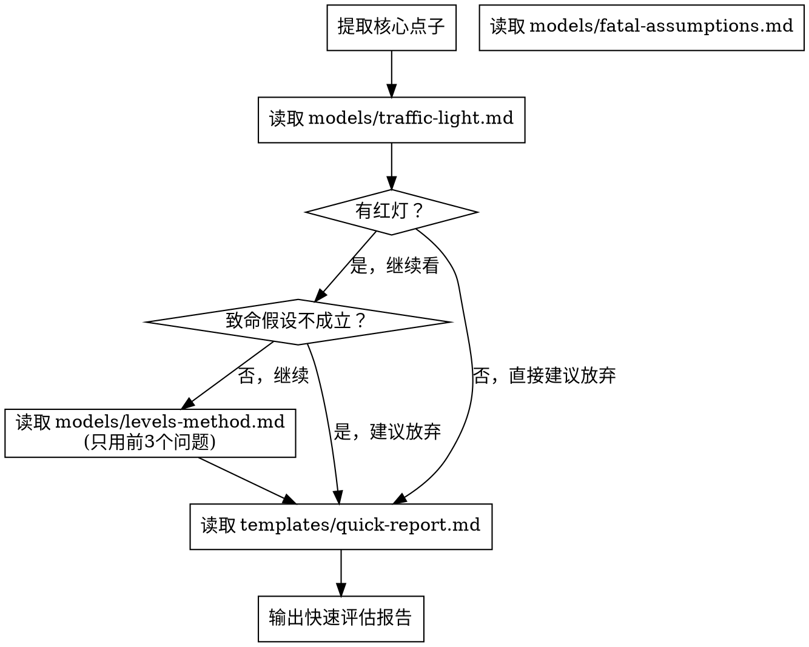

# Quick 模式流程

5 分钟内给出明确结论。不启动搜索 agent，只用 2 个核心模型快速评估。
适用于灵感闪现、一句话描述点子、用户想快速得到"做还是不做"的判断。

## 流程

### Step 1：提取核心点子
从用户的描述中提炼出一句话：

> "用户想做 [一句话描述点子]，视角是 [OPC/团队]，目标用户是 [谁]，核心价值是 [什么]"

如果用户没说清楚目标用户或核心价值，**先问**再评估，不要猜。

### Step 2：红黄绿灯快速评估
读取 `models/traffic-light.md`，对点子打 5 盏灯。

**视角适配**：如果用户是团队视角，第 5 个维度从"OPC 可行性"替换为"团队可行性"，
参照 `models/traffic-light.md` 中的团队视角适配段落。

**如果出现红灯**：
- **1 个红灯 + 无绿灯** → 直接跳到 Step 5，建议放弃
- **1 个红灯 + 有绿灯** → 继续评估，红灯维度是核心风险但不是一票否决
- 多个红灯 → 直接跳到 Step 5，建议放弃

**如果没有红灯**：继续 Step 3。

### Step 2.5：领域风险快速扫描（可选）

如果红黄绿灯评估中"OPC 可行性"或"必要性"出现黄灯或红灯，
快速扫一眼 `models/domain-check.md` 的领域识别表，看是否匹配到了
高风险领域（金融、医疗、教育、社交等）。

如果匹配到了：
- 在后续报告中额外提醒用户该领域的合规要求和特殊风险
- 建议用户走 Deep 模式做完整的领域专项检查

不需要完整执行领域检查模型——Quick 模式只要"看到了就提一句"。

### Step 3：致命假设快速检查
读取 `models/fatal-assumptions.md`，但只做快速版：
- 列出 1-2 个最核心的假设（不需要穷举）
- 基于常识和经验判断是否站得住脚
- 不需要搜索验证

**如果致命假设明显不成立**：
- 直接跳到 Step 5 输出报告
- 在报告中说明哪个假设不成立

**如果致命假设看起来可行**：继续 Step 4。

### Step 4：Levels 方法快速验证（精简版）
读取 `models/levels-method.md`，但只回答前 3 个问题：

1. 一个周末能上线 MVP 吗？
2. 能用 no-code 或简单技术实现吗？
3. 有人已经在为类似的东西付费吗？

不需要完整走完 6 个问题，3 个足以给出方向判断。

### Step 5：输出快速评估报告
读取 `templates/quick-report.md`，按模板格式输出报告。

**重要**：Quick 模式的报告直接在终端展示，不写文件。
报告应该简洁有力——用户要的是结论，不是长篇分析。

## 注意事项

- Quick 模式**不使用 WebSearch**，所有判断基于 AI 知识和逻辑推理
- 如果用户追问"你怎么知道"，建议切换到 Deep 模式做有数据支撑的评估
- Quick 模式的结论是**初步判断**，不是最终结论。如果用户想确认，建议走 Deep 模式
- 整个过程控制在 5 分钟内，不要过度展开
